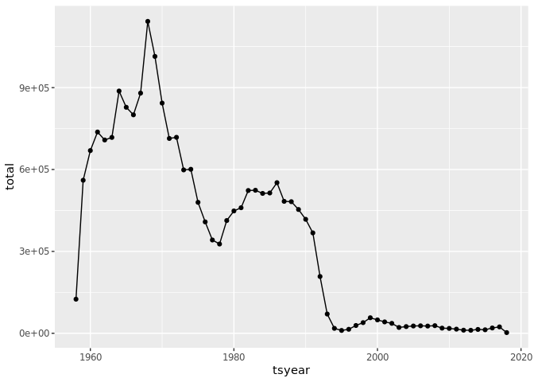
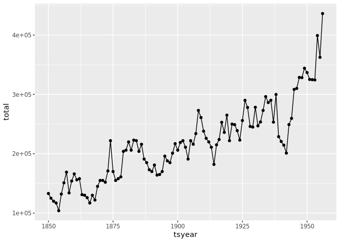
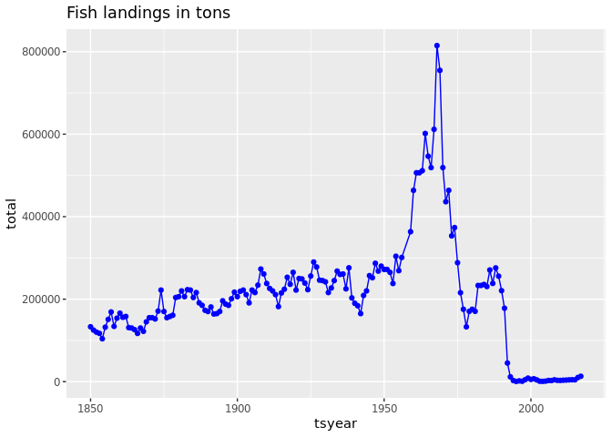
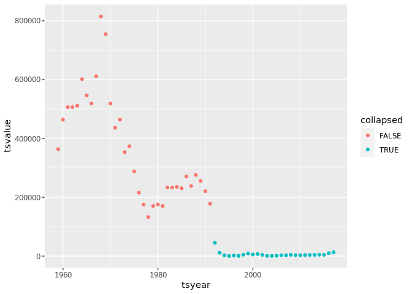

Mark and Jiawen Fisheries Collapse Project
================
Carl Boettiger & Dana Seidel & Xiangrong (Mark) Sun & Jiawen Tang

Setups before we start:

``` r
library(tidyverse)
```

    ## ── Attaching packages ─────────────────────────────────────── tidyverse 1.3.0 ──

    ## ✔ ggplot2 3.4.3     ✔ purrr   1.0.2
    ## ✔ tibble  3.2.1     ✔ dplyr   1.1.3
    ## ✔ tidyr   1.3.0     ✔ stringr 1.5.0
    ## ✔ readr   2.1.4     ✔ forcats 1.0.0

    ## ── Conflicts ────────────────────────────────────────── tidyverse_conflicts() ──
    ## ✖ dplyr::filter() masks stats::filter()
    ## ✖ dplyr::lag()    masks stats::lag()

``` r
library(readxl)
```

``` r
options(timeout=1000)
```

``` r
download.file("https://zenodo.org/record/7814638/files/RAMLDB%20v4.61.zip?download=1",
              "fish.zip")
```

# Fisheries Collapse

In this project, we will prove and visualize the fisheries collapse in
1992 using the fisheries stock assessment data. We will first use the
North Atlantic Cod as a specific case study and then reproduce the whole
fisheries globally.

We will be working with a large relational database containing many
different tables of different sizes and shapes, but all all related to
each other through a series of different ids.

## The Database

We will use data from the [RAM Legacy Stock Assessment
Database](https://www.ramlegacy.org/database/)

``` r
xlsx <- "Excel/RAMLDB v4.61 (assessment data only).xlsx"
readxl::excel_sheets(xlsx)
```

    ##  [1] "area"                         "assessment"                  
    ##  [3] "assessmethod"                 "assessor"                    
    ##  [5] "biometrics"                   "bioparams"                   
    ##  [7] "bioparams_assessments_views"  "bioparams_ids_views"         
    ##  [9] "bioparams_notes_views"        "bioparams_sources_views"     
    ## [11] "bioparams_units_views"        "bioparams_values_views"      
    ## [13] "management"                   "stock"                       
    ## [15] "taxonomy"                     "timeseries.1"                
    ## [17] "timeseries.2"                 "timeseries_assessments_views"
    ## [19] "timeseries_ids_views"         "timeseries_notes_views"      
    ## [21] "timeseries_sources_views"     "timeseries_units_views"      
    ## [23] "timeseries_values_views"      "timeseries_years_views"      
    ## [25] "tsmetrics"

# Part 1: Investigating the North-Atlantic Cod

We seek to replicate the following figure from the Millennium Ecosystem
Assessment Project using the RAM data. This is the original data:


## Merge all the data into a readable table

``` r
ts1 <- read_xlsx(xlsx, sheet = "timeseries.1")
ts2 <- read_xlsx(xlsx, sheet = "timeseries.2")
assess<-read_xlsx(xlsx,sheet = "assessment")

ts <- bind_rows(ts1, ts2) |>
      distinct() |> 
      filter(tsid == "TCbest-MT")
metrics <- read_xlsx(xlsx, sheet = "tsmetrics")

units <- metrics |> 
  filter(tscategory == "CATCH or LANDINGS") |>
  filter(tsunitslong == "Metric tons")

ts <- ts |> left_join(metrics, by=c("tsid" = "tsunique"))

stock <- read_xlsx(xlsx, sheet = "stock")
ts <- ts |> left_join(stock)
```

    ## Joining with `by = join_by(stockid, stocklong)`

``` r
area <- read_xlsx(xlsx, sheet = "area")
ts <- ts |> left_join(area)
```

    ## Joining with `by = join_by(areaid)`

``` r
ts
```

    ## # A tibble: 122,255 × 29
    ##    assessid     stockid stocklong tsid  tsyear tsvalue tscategory tsshort tslong
    ##    <chr>        <chr>   <chr>     <chr>  <dbl>   <dbl> <chr>      <chr>   <chr> 
    ##  1 ABARES-BGRD… BGRDRSE Blue gre… TCbe…   1960      NA CATCH or … TCbest  Gener…
    ##  2 ABARES-BGRD… BGRDRSE Blue gre… TCbe…   1961      NA CATCH or … TCbest  Gener…
    ##  3 ABARES-BGRD… BGRDRSE Blue gre… TCbe…   1962      NA CATCH or … TCbest  Gener…
    ##  4 ABARES-BGRD… BGRDRSE Blue gre… TCbe…   1963      NA CATCH or … TCbest  Gener…
    ##  5 ABARES-BGRD… BGRDRSE Blue gre… TCbe…   1964      NA CATCH or … TCbest  Gener…
    ##  6 ABARES-BGRD… BGRDRSE Blue gre… TCbe…   1965      NA CATCH or … TCbest  Gener…
    ##  7 ABARES-BGRD… BGRDRSE Blue gre… TCbe…   1966      NA CATCH or … TCbest  Gener…
    ##  8 ABARES-BGRD… BGRDRSE Blue gre… TCbe…   1967      NA CATCH or … TCbest  Gener…
    ##  9 ABARES-BGRD… BGRDRSE Blue gre… TCbe…   1968      NA CATCH or … TCbest  Gener…
    ## 10 ABARES-BGRD… BGRDRSE Blue gre… TCbe…   1969      NA CATCH or … TCbest  Gener…
    ## # ℹ 122,245 more rows
    ## # ℹ 20 more variables: tsunitsshort <chr>, tsunitslong <chr>, tsn <dbl>,
    ## #   scientificname <chr>, commonname <chr>, areaid <chr>, region <chr>,
    ## #   primary_country <chr>, primary_FAOarea <dbl>, ISO3_code <chr>,
    ## #   GRSF_uuid <chr>, GRSF_areaid <chr>, inmyersdb <dbl>, myersstockid <chr>,
    ## #   state <chr>, country <chr>, areatype <chr>, areacode <chr>, areaname <chr>,
    ## #   alternateareaname <chr>

## Create a time-dependent dataset

``` r
most_recent <-
  assess |> 
  left_join(stock) |>
  filter(commonname == "Atlantic cod") |>
  filter(mostrecent == 999) |>
  select(assessid)
```

    ## Joining with `by = join_by(stockid, stocklong)`

``` r
least_recent <-
  assess |> 
  left_join(stock) |>
  filter(commonname == "Atlantic cod") |>
  filter(mostrecent == 0) |>
  select(assessid)
```

    ## Joining with `by = join_by(stockid, stocklong)`

## Try to find Data in two time period

Make two graphs:

``` r
cod <- ts |>
  filter(scientificname == "Gadus morhua") |>
  filter(country=="Canada") |>
  filter(tsyear > 1957) |>
  inner_join(most_recent, by = "assessid") 

cod2 <- ts |>
  filter(scientificname == "Gadus morhua") |>
  filter(country=="Canada") |>
  filter(tsyear < 1957) |>
  inner_join(least_recent, by = "assessid") 

cod |>
  group_by(tsyear) |>
  summarize(total = sum(tsvalue, na.rm = TRUE)) |>
  ggplot(aes(tsyear,total)) + geom_point() +geom_line()
```

<!-- -->

``` r
cod2 |>
  group_by(tsyear) |>
  summarize(total = sum(tsvalue, na.rm = TRUE)) |>
  ggplot(aes(tsyear,total)) + geom_point() +geom_line()
```

<!-- -->

Now we have all we want, lets recreate the graph we want:

``` r
options(scipen = 999)
cod_2J3KL <- cod |>
  filter(stockid =="COD2J3KL") |>
  filter(areaid == "Canada-DFO-2J3KL") |>
  inner_join(most_recent, by = "assessid") 
cod2J3KL_post1957 <- cod_2J3KL |>
  group_by(tsyear) |>
  summarise(total = sum(tsvalue, na.rm = TRUE))
#cod2J3KL_post1957 |> ggplot(aes(tsyear,total)) + geom_line() + geom_point()
cod2J3KL_pre1957 <- cod2 |>
  filter(stockid =="COD2J3KL") |>
  filter(areaid == "Canada-DFO-2J3KL") |>
  inner_join(least_recent, by = "assessid") |> 
  group_by(tsyear) |>
  summarise(total = sum(tsvalue, na.rm = TRUE)) |>
  filter(tsyear < 1957)
#cod2J3KL_pre1957 |> ggplot(aes(tsyear,total)) + geom_line() + geom_point()
cod2J3KL_ALL <- rbind(cod2J3KL_post1957, cod2J3KL_pre1957)
ggplot(cod2J3KL_ALL, aes(tsyear, total, group = 1)) +
  geom_line(col = "blue") + geom_point(col = "blue")+ggtitle("Fish landings in tons")
```

<!-- -->

------------------------------------------------------------------------

# Exercise 2: Group Assignment

## Stock Collapses

We seek to replicate the temporal trend in stock declines shown in [Worm
et al 2006](http://doi.org/10.1126/science.1132294):


``` r
fish <- cod_2J3KL |>
  select(tsyear, tsvalue, stockid, areaid) |>
  mutate(collapsed = tsvalue < 0.1 * max(tsvalue, na.rm = TRUE))

fish |>
  ggplot(aes(tsyear, tsvalue, col = collapsed)) + geom_point() 
```

<!-- -->

``` r
catch <- ts %>%
  filter(tsid == "TCbest-MT") |>
  group_by(tsyear, scientificname) |>
  summarise(total_catch = sum(tsvalue, na.rm = TRUE)) |>
  group_by(scientificname) |>
  mutate(current_tot = cummax(total_catch), 
         is_collapse = total_catch < 0.1 *current_tot,
         ever_collapse = cumsum(is_collapse) > 0)
```

    ## `summarise()` has grouped output by 'tsyear'. You can override using the
    ## `.groups` argument.

``` r
years <- 1950:2003

n <- nrow(catch |> 
            group_by(scientificname, tsyear) |>
            filter(tsyear %in% years) |>
            group_by(scientificname)|>
            count() |>
            filter(n == length(years))
            )
```

``` r
catch_prop <- catch |>
  filter(tsyear %in% years) |>
  group_by(tsyear)|>
  summarise(collapse = sum(is_collapse),
            ever_collapsed = sum(ever_collapse),
            .groups = 'drop')|>
  group_by(tsyear)|>
  mutate(collapsed_taxa = 100.0 * collapse / n)|>
  ungroup()|>
  mutate(collapsed_taxa_cum = 100.0 * ever_collapsed / n) |>
  select(tsyear, collapsed_taxa, collapsed_taxa_cum)

catch_graph <- catch_prop |>
  pivot_longer(cols =
                 collapsed_taxa:collapsed_taxa_cum, names_to = "category", values_to = "count")

catch_graph
```

    ## # A tibble: 108 × 3
    ##    tsyear category           count
    ##     <dbl> <chr>              <dbl>
    ##  1   1950 collapsed_taxa      1.69
    ##  2   1950 collapsed_taxa_cum 16.1 
    ##  3   1951 collapsed_taxa      2.54
    ##  4   1951 collapsed_taxa_cum 16.9 
    ##  5   1952 collapsed_taxa      1.69
    ##  6   1952 collapsed_taxa_cum 17.8 
    ##  7   1953 collapsed_taxa      4.24
    ##  8   1953 collapsed_taxa_cum 19.5 
    ##  9   1954 collapsed_taxa      2.54
    ## 10   1954 collapsed_taxa_cum 19.5 
    ## # ℹ 98 more rows

``` r
ggplot(data = catch_graph,aes(x=tsyear, y=count,shape= category))+
  geom_smooth(se = FALSE, col="black",linewidth = 0.5)+
  geom_point()+
  scale_y_reverse()+
  labs(y = "Collapsed taxt (%)",
       x = "year")+
  ggtitle("Stock Collapses")
```

    ## `geom_smooth()` using method = 'loess' and formula = 'y ~ x'

<!-- -->

\`\`\`
