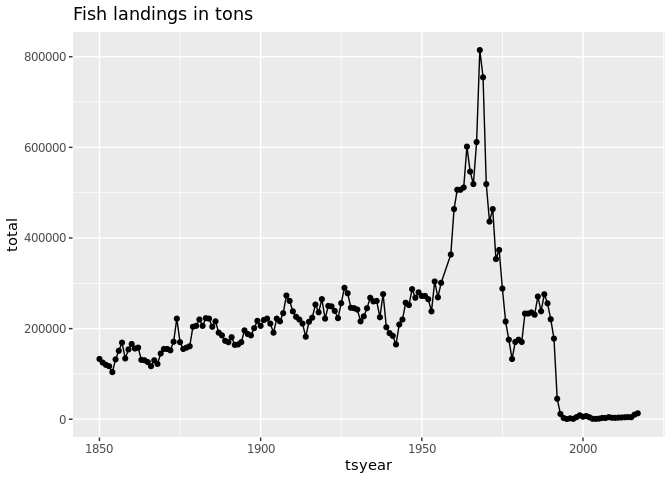

``` r
library(tidyverse)
```

    ## ── Attaching packages ─────────────────────────────────────── tidyverse 1.3.0 ──

    ## ✔ ggplot2 3.4.3     ✔ purrr   1.0.2
    ## ✔ tibble  3.2.1     ✔ dplyr   1.1.3
    ## ✔ tidyr   1.3.0     ✔ stringr 1.5.0
    ## ✔ readr   2.1.4     ✔ forcats 1.0.0

    ## ── Conflicts ────────────────────────────────────────── tidyverse_conflicts() ──
    ## ✖ dplyr::filter() masks stats::filter()
    ## ✖ dplyr::lag()    masks stats::lag()

``` r
library(readxl)
```

``` r
options(timeout=1000)
```

``` r
download.file("https://zenodo.org/record/7814638/files/RAMLDB%20v4.61.zip?download=1",
              "fish.zip")
```

``` r
xlsx <- "Excel/RAMLDB v4.61 (assessment data only).xlsx"
readxl::excel_sheets(xlsx)
```

    ##  [1] "area"                         "assessment"                  
    ##  [3] "assessmethod"                 "assessor"                    
    ##  [5] "biometrics"                   "bioparams"                   
    ##  [7] "bioparams_assessments_views"  "bioparams_ids_views"         
    ##  [9] "bioparams_notes_views"        "bioparams_sources_views"     
    ## [11] "bioparams_units_views"        "bioparams_values_views"      
    ## [13] "management"                   "stock"                       
    ## [15] "taxonomy"                     "timeseries.1"                
    ## [17] "timeseries.2"                 "timeseries_assessments_views"
    ## [19] "timeseries_ids_views"         "timeseries_notes_views"      
    ## [21] "timeseries_sources_views"     "timeseries_units_views"      
    ## [23] "timeseries_values_views"      "timeseries_years_views"      
    ## [25] "tsmetrics"

``` r
ts1 <- read_xlsx(xlsx, sheet = "timeseries.1")
ts2 <- read_xlsx(xlsx, sheet = "timeseries.2")
assess<-read_xlsx(xlsx,sheet = "assessment")


ts <- bind_rows(ts1, ts2) |>
      distinct() |> 
      filter(tsid == "TCbest-MT")
ts
```

    ## # A tibble: 122,255 × 6
    ##    assessid                       stockid stocklong         tsid  tsyear tsvalue
    ##    <chr>                          <chr>   <chr>             <chr>  <dbl>   <dbl>
    ##  1 ABARES-BGRDRSE-1960-2011-CHING BGRDRSE Blue grenadier S… TCbe…   1960      NA
    ##  2 ABARES-BGRDRSE-1960-2011-CHING BGRDRSE Blue grenadier S… TCbe…   1961      NA
    ##  3 ABARES-BGRDRSE-1960-2011-CHING BGRDRSE Blue grenadier S… TCbe…   1962      NA
    ##  4 ABARES-BGRDRSE-1960-2011-CHING BGRDRSE Blue grenadier S… TCbe…   1963      NA
    ##  5 ABARES-BGRDRSE-1960-2011-CHING BGRDRSE Blue grenadier S… TCbe…   1964      NA
    ##  6 ABARES-BGRDRSE-1960-2011-CHING BGRDRSE Blue grenadier S… TCbe…   1965      NA
    ##  7 ABARES-BGRDRSE-1960-2011-CHING BGRDRSE Blue grenadier S… TCbe…   1966      NA
    ##  8 ABARES-BGRDRSE-1960-2011-CHING BGRDRSE Blue grenadier S… TCbe…   1967      NA
    ##  9 ABARES-BGRDRSE-1960-2011-CHING BGRDRSE Blue grenadier S… TCbe…   1968      NA
    ## 10 ABARES-BGRDRSE-1960-2011-CHING BGRDRSE Blue grenadier S… TCbe…   1969      NA
    ## # ℹ 122,245 more rows

``` r
metrics <- read_xlsx(xlsx, sheet = "tsmetrics")

units <- metrics |> 
  filter(tscategory == "CATCH or LANDINGS") |>
  filter(tsunitslong == "Metric tons")
metrics
```

    ## # A tibble: 452 × 6
    ##    tscategory             tsshort       tslong tsunitsshort tsunitslong tsunique
    ##    <chr>                  <chr>         <chr>  <chr>        <chr>       <chr>   
    ##  1 OTHER TIME SERIES DATA AQ            Aquac… MT           metric tons AQ-MT   
    ##  2 OTHER TIME SERIES DATA ASP           Annua… MT           Metric tons ASP-MT  
    ##  3 TOTAL BIOMASS          BdivBmgtpref  Gener… dimensionle… dimensionl… BdivBmg…
    ##  4 TOTAL BIOMASS          BdivBmgttouse Gener… dimensionle… dimensionl… BdivBmg…
    ##  5 TOTAL BIOMASS          BdivBmsypref  Gener… dimensionle… dimensionl… BdivBms…
    ##  6 TOTAL BIOMASS          BdivBmsytouse Gener… dimensionle… dimensionl… BdivBms…
    ##  7 OTHER TIME SERIES DATA BYCAT         Indus… MT           Metric tons BYCAT-MT
    ##  8 CATCH or LANDINGS      Cadvised-CMB  Scien… MT           Metric tons Cadvise…
    ##  9 CATCH or LANDINGS      Cadvised      Scien… MT           Metric tons Cadvise…
    ## 10 CATCH or LANDINGS      CdivMEANC     Catch… ratio        ratio       CdivMEA…
    ## # ℹ 442 more rows

``` r
ts <- ts |> left_join(metrics, by=c("tsid" = "tsunique"))
ts
```

    ## # A tibble: 122,255 × 11
    ##    assessid     stockid stocklong tsid  tsyear tsvalue tscategory tsshort tslong
    ##    <chr>        <chr>   <chr>     <chr>  <dbl>   <dbl> <chr>      <chr>   <chr> 
    ##  1 ABARES-BGRD… BGRDRSE Blue gre… TCbe…   1960      NA CATCH or … TCbest  Gener…
    ##  2 ABARES-BGRD… BGRDRSE Blue gre… TCbe…   1961      NA CATCH or … TCbest  Gener…
    ##  3 ABARES-BGRD… BGRDRSE Blue gre… TCbe…   1962      NA CATCH or … TCbest  Gener…
    ##  4 ABARES-BGRD… BGRDRSE Blue gre… TCbe…   1963      NA CATCH or … TCbest  Gener…
    ##  5 ABARES-BGRD… BGRDRSE Blue gre… TCbe…   1964      NA CATCH or … TCbest  Gener…
    ##  6 ABARES-BGRD… BGRDRSE Blue gre… TCbe…   1965      NA CATCH or … TCbest  Gener…
    ##  7 ABARES-BGRD… BGRDRSE Blue gre… TCbe…   1966      NA CATCH or … TCbest  Gener…
    ##  8 ABARES-BGRD… BGRDRSE Blue gre… TCbe…   1967      NA CATCH or … TCbest  Gener…
    ##  9 ABARES-BGRD… BGRDRSE Blue gre… TCbe…   1968      NA CATCH or … TCbest  Gener…
    ## 10 ABARES-BGRD… BGRDRSE Blue gre… TCbe…   1969      NA CATCH or … TCbest  Gener…
    ## # ℹ 122,245 more rows
    ## # ℹ 2 more variables: tsunitsshort <chr>, tsunitslong <chr>

``` r
stock <- read_xlsx(xlsx, sheet = "stock")
stock
```

    ## # A tibble: 1,509 × 15
    ##    stockid             tsn scientificname     commonname areaid stocklong region
    ##    <chr>             <dbl> <chr>              <chr>      <chr>  <chr>     <chr> 
    ##  1 ACADRED2J3K      166774 Sebastes fasciatus Acadian r… Canad… Acadian … Canad…
    ##  2 ACADRED3LNO-UT12 166774 Sebastes fasciatus Acadian r… Canad… Acadian … Canad…
    ##  3 ACADREDGOMGB     166774 Sebastes fasciatus Acadian r… USA-N… Acadian … US Ea…
    ##  4 ACADREDUT3       166774 Sebastes fasciatus Acadian r… Canad… Acadian … Canad…
    ##  5 ACMACKSARG       172413 Scomber colias     Argentine… Argen… Argentin… South…
    ##  6 AFLONCH          166156 Beryx splendens    Alfonsino  multi… Alfonsin… South…
    ##  7 ALBAIO           172419 Thunnus alalunga   Albacore … multi… Albacore… India…
    ##  8 ALBAMED          172419 Thunnus alalunga   Albacore … multi… Albacore… Medit…
    ##  9 ALBANATL         172419 Thunnus alalunga   Albacore … multi… Albacore… Atlan…
    ## 10 ALBANPAC         172419 Thunnus alalunga   Albacore … multi… Albacore… Pacif…
    ## # ℹ 1,499 more rows
    ## # ℹ 8 more variables: primary_country <chr>, primary_FAOarea <dbl>,
    ## #   ISO3_code <chr>, GRSF_uuid <chr>, GRSF_areaid <chr>, inmyersdb <dbl>,
    ## #   myersstockid <chr>, state <chr>

``` r
#units <- stock |> 
  #filter(tscategory == "CATCH or LANDINGS") |>
  #filter(tsunitslong == "Metric tons")
ts <- ts |> left_join(stock)
```

    ## Joining with `by = join_by(stockid, stocklong)`

``` r
ts
```

    ## # A tibble: 122,255 × 24
    ##    assessid     stockid stocklong tsid  tsyear tsvalue tscategory tsshort tslong
    ##    <chr>        <chr>   <chr>     <chr>  <dbl>   <dbl> <chr>      <chr>   <chr> 
    ##  1 ABARES-BGRD… BGRDRSE Blue gre… TCbe…   1960      NA CATCH or … TCbest  Gener…
    ##  2 ABARES-BGRD… BGRDRSE Blue gre… TCbe…   1961      NA CATCH or … TCbest  Gener…
    ##  3 ABARES-BGRD… BGRDRSE Blue gre… TCbe…   1962      NA CATCH or … TCbest  Gener…
    ##  4 ABARES-BGRD… BGRDRSE Blue gre… TCbe…   1963      NA CATCH or … TCbest  Gener…
    ##  5 ABARES-BGRD… BGRDRSE Blue gre… TCbe…   1964      NA CATCH or … TCbest  Gener…
    ##  6 ABARES-BGRD… BGRDRSE Blue gre… TCbe…   1965      NA CATCH or … TCbest  Gener…
    ##  7 ABARES-BGRD… BGRDRSE Blue gre… TCbe…   1966      NA CATCH or … TCbest  Gener…
    ##  8 ABARES-BGRD… BGRDRSE Blue gre… TCbe…   1967      NA CATCH or … TCbest  Gener…
    ##  9 ABARES-BGRD… BGRDRSE Blue gre… TCbe…   1968      NA CATCH or … TCbest  Gener…
    ## 10 ABARES-BGRD… BGRDRSE Blue gre… TCbe…   1969      NA CATCH or … TCbest  Gener…
    ## # ℹ 122,245 more rows
    ## # ℹ 15 more variables: tsunitsshort <chr>, tsunitslong <chr>, tsn <dbl>,
    ## #   scientificname <chr>, commonname <chr>, areaid <chr>, region <chr>,
    ## #   primary_country <chr>, primary_FAOarea <dbl>, ISO3_code <chr>,
    ## #   GRSF_uuid <chr>, GRSF_areaid <chr>, inmyersdb <dbl>, myersstockid <chr>,
    ## #   state <chr>

``` r
most_recent <-
  assess |> 
  left_join(stock) |>
  filter(commonname == "Atlantic cod") |>
  filter(mostrecent == 999) |>
  select(assessid)
```

    ## Joining with `by = join_by(stockid, stocklong)`

``` r
most_recent
```

    ## # A tibble: 27 × 1
    ##    assessid                               
    ##    <chr>                                  
    ##  1 AFWG-CODNEAR-1946-2020-ICESIMP2021-2   
    ##  2 AFWG-CODNEARNCW-1984-2019-ICESIMP2021-2
    ##  3 DFO-MAR-COD4VsW-1958-2002-PREFONTAINE  
    ##  4 DFO-MAR-COD4X5Yb-1960-2018-ASHBROOK    
    ##  5 DFO-NFLD-COD2J3KL-1959-2018-ASHBROOK   
    ##  6 DFO-NFLD-COD3Ps-1959-2018-ASHBROOK     
    ##  7 DFO-QUE-COD3Pn4RS-1964-2019-ASHBROOK   
    ##  8 DFO-SG-COD4TVn-1917-2018-ASHBROOK      
    ##  9 NAFO-SC-COD3M-1960-2012-CHING          
    ## 10 NAFO-SC-COD3NO-1953-2011-CHING         
    ## # ℹ 17 more rows

``` r
least_recent <-
  assess |> 
  left_join(stock) |>
  filter(commonname == "Atlantic cod") |>
  filter(mostrecent == 0) |>
  select(assessid)
```

    ## Joining with `by = join_by(stockid, stocklong)`

``` r
least_recent
```

    ## # A tibble: 120 × 1
    ##    assessid                             
    ##    <chr>                                
    ##  1 AFWG-CODNEAR-1943-2013-ICESIMP2016   
    ##  2 AFWG-CODNEAR-1943-2014-ICESIMP2016   
    ##  3 AFWG-CODNEAR-1943-2015-ICESIMP2016   
    ##  4 AFWG-CODNEAR-1943-2016-ICESIMP2016   
    ##  5 AFWG-CODNEAR-1943-2017-ICESIMP2018   
    ##  6 AFWG-CODNEAR-1943-2018-ICESIMP2018   
    ##  7 AFWG-CODNEAR-1943-2019-ICESIMP2021   
    ##  8 AFWG-CODNEAR-1946-2011-CHING         
    ##  9 AFWG-CODNEARNCW-1982-2016-ICESIMP2016
    ## 10 AFWG-CODNEARNCW-1982-2018-ICESIMP2021
    ## # ℹ 110 more rows

``` r
area <- read_xlsx(xlsx, sheet = "area")
area
```

    ## # A tibble: 897 × 6
    ##    country   areatype areacode areaname                 alternateareaname areaid
    ##    <chr>     <chr>    <chr>    <chr>                    <chr>             <chr> 
    ##  1 Argentina CFP      ARG-N    Northern Argentina       NA                Argen…
    ##  2 Argentina CFP      ARG-S    Southern Argentina       NA                Argen…
    ##  3 Australia AFMA     CASCADE  Cascade Plateau          NA                Austr…
    ##  4 Australia AFMA     EAUS     Eastern Australia        NA                Austr…
    ##  5 Australia AFMA     ESE      Eastern half of Southea… NA                Austr…
    ##  6 Australia AFMA     GAB      Great Australian Bight   NA                Austr…
    ##  7 Australia AFMA     MI       Macquarie Island         <NA>              Austr…
    ##  8 Australia AFMA     NAUST    Northern Australia       NA                Austr…
    ##  9 Australia AFMA     NSWWA    New South Wales to West… NA                Austr…
    ## 10 Australia AFMA     SE       Southeast Australia      NA                Austr…
    ## # ℹ 887 more rows

``` r
ts <- ts |> left_join(area)
```

    ## Joining with `by = join_by(areaid)`

``` r
ts
```

    ## # A tibble: 122,255 × 29
    ##    assessid     stockid stocklong tsid  tsyear tsvalue tscategory tsshort tslong
    ##    <chr>        <chr>   <chr>     <chr>  <dbl>   <dbl> <chr>      <chr>   <chr> 
    ##  1 ABARES-BGRD… BGRDRSE Blue gre… TCbe…   1960      NA CATCH or … TCbest  Gener…
    ##  2 ABARES-BGRD… BGRDRSE Blue gre… TCbe…   1961      NA CATCH or … TCbest  Gener…
    ##  3 ABARES-BGRD… BGRDRSE Blue gre… TCbe…   1962      NA CATCH or … TCbest  Gener…
    ##  4 ABARES-BGRD… BGRDRSE Blue gre… TCbe…   1963      NA CATCH or … TCbest  Gener…
    ##  5 ABARES-BGRD… BGRDRSE Blue gre… TCbe…   1964      NA CATCH or … TCbest  Gener…
    ##  6 ABARES-BGRD… BGRDRSE Blue gre… TCbe…   1965      NA CATCH or … TCbest  Gener…
    ##  7 ABARES-BGRD… BGRDRSE Blue gre… TCbe…   1966      NA CATCH or … TCbest  Gener…
    ##  8 ABARES-BGRD… BGRDRSE Blue gre… TCbe…   1967      NA CATCH or … TCbest  Gener…
    ##  9 ABARES-BGRD… BGRDRSE Blue gre… TCbe…   1968      NA CATCH or … TCbest  Gener…
    ## 10 ABARES-BGRD… BGRDRSE Blue gre… TCbe…   1969      NA CATCH or … TCbest  Gener…
    ## # ℹ 122,245 more rows
    ## # ℹ 20 more variables: tsunitsshort <chr>, tsunitslong <chr>, tsn <dbl>,
    ## #   scientificname <chr>, commonname <chr>, areaid <chr>, region <chr>,
    ## #   primary_country <chr>, primary_FAOarea <dbl>, ISO3_code <chr>,
    ## #   GRSF_uuid <chr>, GRSF_areaid <chr>, inmyersdb <dbl>, myersstockid <chr>,
    ## #   state <chr>, country <chr>, areatype <chr>, areacode <chr>, areaname <chr>,
    ## #   alternateareaname <chr>

``` r
cod <- ts |>
  filter(scientificname == "Gadus morhua") |>
  filter(country=="Canada") |>
  filter(tsyear > 1957) |>
  inner_join(most_recent, by = "assessid") 
cod
```

    ## # A tibble: 337 × 29
    ##    assessid     stockid stocklong tsid  tsyear tsvalue tscategory tsshort tslong
    ##    <chr>        <chr>   <chr>     <chr>  <dbl>   <dbl> <chr>      <chr>   <chr> 
    ##  1 DFO-MAR-COD… COD4VsW Atlantic… TCbe…   1958   38600 CATCH or … TCbest  Gener…
    ##  2 DFO-MAR-COD… COD4VsW Atlantic… TCbe…   1959   66000 CATCH or … TCbest  Gener…
    ##  3 DFO-MAR-COD… COD4VsW Atlantic… TCbe…   1960   50600 CATCH or … TCbest  Gener…
    ##  4 DFO-MAR-COD… COD4VsW Atlantic… TCbe…   1961   66300 CATCH or … TCbest  Gener…
    ##  5 DFO-MAR-COD… COD4VsW Atlantic… TCbe…   1962   65200 CATCH or … TCbest  Gener…
    ##  6 DFO-MAR-COD… COD4VsW Atlantic… TCbe…   1963   68200 CATCH or … TCbest  Gener…
    ##  7 DFO-MAR-COD… COD4VsW Atlantic… TCbe…   1964   63300 CATCH or … TCbest  Gener…
    ##  8 DFO-MAR-COD… COD4VsW Atlantic… TCbe…   1965   71000 CATCH or … TCbest  Gener…
    ##  9 DFO-MAR-COD… COD4VsW Atlantic… TCbe…   1966   68500 CATCH or … TCbest  Gener…
    ## 10 DFO-MAR-COD… COD4VsW Atlantic… TCbe…   1967   54200 CATCH or … TCbest  Gener…
    ## # ℹ 327 more rows
    ## # ℹ 20 more variables: tsunitsshort <chr>, tsunitslong <chr>, tsn <dbl>,
    ## #   scientificname <chr>, commonname <chr>, areaid <chr>, region <chr>,
    ## #   primary_country <chr>, primary_FAOarea <dbl>, ISO3_code <chr>,
    ## #   GRSF_uuid <chr>, GRSF_areaid <chr>, inmyersdb <dbl>, myersstockid <chr>,
    ## #   state <chr>, country <chr>, areatype <chr>, areacode <chr>, areaname <chr>,
    ## #   alternateareaname <chr>

``` r
#cod2 1850-1945 correct
cod2 <- ts |>
  filter(scientificname == "Gadus morhua") |>
  filter(country=="Canada") |>
  filter(tsyear < 1957) |>
  inner_join(least_recent, by = "assessid") 
cod2
```

    ## # A tibble: 147 × 29
    ##    assessid     stockid stocklong tsid  tsyear tsvalue tscategory tsshort tslong
    ##    <chr>        <chr>   <chr>     <chr>  <dbl>   <dbl> <chr>      <chr>   <chr> 
    ##  1 DFO-COD4X5Y… COD4X5… Atlantic… TCbe…   1948   19800 CATCH or … TCbest  Gener…
    ##  2 DFO-COD4X5Y… COD4X5… Atlantic… TCbe…   1949   16100 CATCH or … TCbest  Gener…
    ##  3 DFO-COD4X5Y… COD4X5… Atlantic… TCbe…   1950   20700 CATCH or … TCbest  Gener…
    ##  4 DFO-COD4X5Y… COD4X5… Atlantic… TCbe…   1951   18200 CATCH or … TCbest  Gener…
    ##  5 DFO-COD4X5Y… COD4X5… Atlantic… TCbe…   1952   18200 CATCH or … TCbest  Gener…
    ##  6 DFO-COD4X5Y… COD4X5… Atlantic… TCbe…   1953   14400 CATCH or … TCbest  Gener…
    ##  7 DFO-COD4X5Y… COD4X5… Atlantic… TCbe…   1954   16900 CATCH or … TCbest  Gener…
    ##  8 DFO-COD4X5Y… COD4X5… Atlantic… TCbe…   1955   14800 CATCH or … TCbest  Gener…
    ##  9 DFO-COD4X5Y… COD4X5… Atlantic… TCbe…   1956   16500 CATCH or … TCbest  Gener…
    ## 10 DFO-MAR-COD… COD4X   Atlantic… TCbe…   1953   13100 CATCH or … TCbest  Gener…
    ## # ℹ 137 more rows
    ## # ℹ 20 more variables: tsunitsshort <chr>, tsunitslong <chr>, tsn <dbl>,
    ## #   scientificname <chr>, commonname <chr>, areaid <chr>, region <chr>,
    ## #   primary_country <chr>, primary_FAOarea <dbl>, ISO3_code <chr>,
    ## #   GRSF_uuid <chr>, GRSF_areaid <chr>, inmyersdb <dbl>, myersstockid <chr>,
    ## #   state <chr>, country <chr>, areatype <chr>, areacode <chr>, areaname <chr>,
    ## #   alternateareaname <chr>

``` r
cod |>
  group_by(tsyear) |>
  summarize(total = sum(tsvalue, na.rm = TRUE)) |>
  ggplot(aes(tsyear,total)) + geom_point() +geom_line()
```

<!-- -->

``` r
cod2 |>
  group_by(tsyear) |>
  summarize(total = sum(tsvalue, na.rm = TRUE)) |>
  ggplot(aes(tsyear,total)) + geom_point() +geom_line()
```

<!-- -->

``` r
cod_2J3KL <- cod |>
  filter(stockid=="COD2J3KL") |>
  filter(areaid== "Canada-DFO-2J3KL") |>
  inner_join(most_recent, by = "assessid") 
cod2J3KL_post1957 <- cod_2J3KL |>
  group_by(tsyear) |>
  summarise(total = sum(tsvalue, na.rm = TRUE))
cod2J3KL_post1957 |> ggplot(aes(tsyear,total)) + geom_line() + geom_point()
```

<!-- -->

``` r
cod2J3KL_pre1957 <- cod2 |>
  filter(stockid=="COD2J3KL") |>
  filter(areaid== "Canada-DFO-2J3KL") |>
  inner_join(least_recent, by = "assessid") |> 
  group_by(tsyear) |>
  summarise(total = sum(tsvalue, na.rm = TRUE)) |>
  filter(tsyear < 1957)
cod2J3KL_pre1957 |> ggplot(aes(tsyear,total)) + geom_line() + geom_point()
```

<!-- -->

``` r
cod2J3KL_ALL <- rbind(cod2J3KL_post1957, cod2J3KL_pre1957)
ggplot(cod2J3KL_ALL, aes(tsyear, total, group = 1)) +
  geom_line() + geom_point()
```

<!-- -->

``` r
cod_2J3KL_new <- cod_2J3KL |>
  select(tsyear, tsvalue,stockid, areaid) |>
  mutate(max_harvest = max(tsvalue),
         collapsed= tsvalue/max_harvest*100) |>
  filter(tsyear > 1968)

cod_2J3KL_new |>
  ggplot(aes(tsyear,collapsed)) + geom_point() +geom_line()
```

<!-- -->

\`\`\`

# Unit 2: Fisheries Collapse Module

This module will focus on understanding and replicating fisheries stock
assessment data and fisheries collapse.

Instead of working with independent data.frames, we will be working with
a large relational database which contains many different tables of
different sizes and shapes, but that all all related to each other
through a series of different ids.

## The Database

We will use data from the [RAM Legacy Stock Assessment
Database](https://www.ramlegacy.org/database/)

# Exercise 1: Investigating the North-Atlantic Cod

Now we are ready to dive into our data. First, We seek to replicate the
following figure from the Millennium Ecosystem Assessment Project using
the RAM data.


## placeholder

------------------------------------------------------------------------

# Exercise 2: Group Assignment

## Stock Collapses

We seek to replicate the temporal trend in stock declines shown in [Worm
et al 2006](http://doi.org/10.1126/science.1132294):


